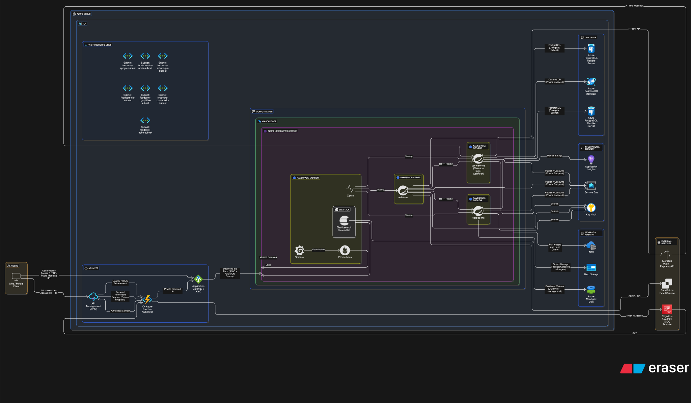

# 🗄️ FoodCore DB

<div align="center">

Provisionamento de bancos de dados do projeto FoodCore via Terraform. Desenvolvido como parte do curso de Arquitetura de Software da FIAP (Tech Challenge).

</div>

<div align="center">
  <a href="#visao-geral">Visão Geral</a> •
  <a href="#sytem-design">System Design</a> •
  <a href="#recursos-provisionados">Recursos Provisionados</a> •
  <a href="#tecnologias">Tecnologias</a> •
  <a href="#modelo-relacional">Modelo Relacional</a> •
  <a href="#justificativa">Justificativas de escolha</a> •
  <a href="#deploy">Fluxo de Deploy</a> •
  <a href="#instalacao-e-uso">Instalação e Uso</a> •
  <a href="#debitos-tecnicos">Débitos Técnicos</a> •
  <a href="#contribuicao">Contribuição</a>
</div><br>

> 📽️ Vídeo de demonstração da arquitetura: [https://youtu.be/k3XbPRxmjCw](https://youtu.be/k3XbPRxmjCw)<br>

---

<h2 id="visao-geral">📋 Visão Geral</h2>

Este repositório contém os scripts Terraform responsáveis pelo provisionamento dos bancos de dados utilizados pelos microsserviços do sistema **FoodCore**, garantindo consistência, escalabilidade e aderência às características de cada domínio de negócio.

A estratégia de persistência foi definida com base nas necessidades funcionais e não funcionais de cada microsserviço, equilibrando **integridade relacional**, **flexibilidade de modelo** e **escala operacional**.

### Bancos de Dados

| Microsserviço | Banco | Tipo |
|---------------|-------|------|
| **foodcore-order** | PostgreSQL Flexible Server | Relacional |
| **foodcore-catalog** | PostgreSQL Flexible Server | Relacional |
| **foodcore-payment** | Azure CosmosDB | NoSQL (Document) |

### Estratégia de Persistência

- **PostgreSQL** é utilizado nos domínios que exigem **consistência forte**, **integridade referencial** e **transações ACID**.
- **Azure Cosmos DB** é utilizado no domínio de pagamentos, priorizando **escalabilidade elástica**, **alta disponibilidade** e **flexibilidade de esquema**.

### Observações Importantes

- **Migrations**: Gerenciadas pelos microsserviços via Liquibase (não neste repositório)
- **Backups**: Não configurados por limitações de crédito (ambiente acadêmico)
- **HA/ZRS**: Desabilitado por limitações de assinatura

---

<h2 id="sytem-design">🧠 System Design</h2>



---

<h2 id="recursos-provisionados">📦 Recursos Provisionados</h2>

| Recurso | Descrição |
|---------|-----------|
| **Azure PostgreSQL Flexible Server (Order)** | Banco de dados de pedidos |
| **Azure PostgreSQL Flexible Server (Catalog)** | Banco de dados de catálogos de produtos |
| **Azure CosmosDB** | Banco de dados de pagamentos |
| **Network Security Groups** | Segurança de rede para os bancos |
| **VNET Integration** | Integração com rede virtual |

### Recursos Delegados pelo Repo de Infra

- Subnet delegada para banco de dados
- Zona de DNS privada
- VNET principal

---

<h2 id="tecnologias">🔧 Tecnologias</h2>

| Categoria | Tecnologia |
|-----------|------------|
| **IaC** | Terraform |
| **Cloud** | Azure |
| **Banco Relacional** | PostgreSQL 16 (Flexible Server)|
| **Banco NoSQL** | CosmosDB |
| **CI/CD** | GitHub Actions |

---

<h2 id="modelo-relacional">📊 Diagramas</h2>

<details>
<summary>Expandir para mais detalhes</summary>

### Diagrama Entidade-Relacionamento


> ⚠️ O microsserviço de pagamento não utiliza um banco de dados relacional, e cada microsserviço tem sua própria instância física. Optamos por desenvolver um MER contendo todos eles e seus "relacionamentos" via `PK` e `FK` apenas para exemplificar suas relações. Na prática, cada microsserviço é independente e se comunica apenas via requisições HTTP ou mensageria.

- **Separação `orders` / `order_items`**: Flexibilidade para combos
- **Índices**: Otimizam consultas de acompanhamento
- **Enums**: Padronizam categorias e status
- **3FN**: Evita redundância e melhora escalabilidade

### Microsserviço Order

```
orders
├── id (PK)
├── customer_id (FK)
├── status (ENUM)
├── total_amount
├── created_at
└── updated_at

order_items
├── id (PK)
├── order_id (FK)
├── product_id
├── quantity
├── unit_price
└── subtotal
```

### Microsserviço Catalog

```
products
├── id (PK)
├── name
├── description
├── price
├── category (ENUM)
├── image_url
└── active

categories
├── id (PK)
├── name
└── description
```

</details>

---

<h2 id="justificativa">❓ Justificativas de escolha</h2>

<details>
<summary>Expandir para mais detalhes</summary>
<br>

O `PostgreSQL` foi adotado nos microsserviços **Catalog** e **Order** por oferecer suporte robusto a integridade relacional, transações ACID e modelagens mais complexas. Em contrapartida, `Azure Cosmos DB (NoSQL)` foi adotado para **Payment** por sua flexibilidade e escalabilidade nativa.

#### Catalog (PostgreSQL)

- Microsserviço com forte exigência de **consistência de dados** e **consultas complexas**.
- Mantém um **schema relacional rico**, com múltiplos relacionamentos e regras de integridade.
- Requer **controle de concorrência rigoroso** para garantir o processamento correto de eventos simultâneos de débito e crédito de estoque para um mesmo item.
- Utiliza **MVCC** e transações **ACID** para evitar condições de corrida e estados inválidos.

> ℹ️ Combinação Teorema PACELC esperada: **P:C / E:C**

#### Order (PostgreSQL)

- Microsserviço central e **núcleo transacional** do sistema.
- Exige **consistência forte** durante todo o ciclo de vida do pedido.
- Mantém um **schema relacional estruturado**, com integridade garantida por chaves primárias e estrangeiras.
- Requer **controle de concorrência** para criação e atualização de pedidos e seus itens.
- Utiliza **MVCC** e transações **ACID** para evitar pedidos incompletos, inconsistentes ou corrompidos.

> ℹ️ Combinação Teorema PACELC esperada: **P:C / E:C**

#### Payment (Azure Cosmos DB)

- Escalabilidade e Disponibilidade:
  - Pagamentos podem sofrer picos imprevisíveis.
  - O Cosmos DB oferece escalabilidade elástica e SLA de **99,999%**, reduzindo riscos no checkout.

- Modelo de Dados Flexível:
  - Gateways e adquirentes retornam payloads heterogêneos.
  - O modelo documental permite armazenar essas variações sem migrações constantes de esquema.

- Distribuição Global:
  - Suporte nativo à replicação multi-região.
  - Facilita expansão internacional e adequação a legislações de soberania de dados.

> ℹ️ Combinação Teorema PACELC esperada: **P:A / E:L**

</details>

---

<h2 id="deploy">⚙️ Fluxo de Deploy</h2>

<details>
<summary>Expandir para mais detalhes</summary>

### Pipeline

1. **Pull Request**
   - Preencher template de pull request adequadamente

2. **Revisão e Aprovação**
   - Mínimo 1 aprovação de CODEOWNER

3. **Merge para Main**

### Proteções

- Branch `main` protegida
- Nenhum push direto permitido
- Todos os checks devem passar

### Ordem de Provisionamento

```
1. foodcore-infra        (AKS, VNET)
2. foodcore-db           (Bancos de dados)
3. foodcore-auth           (Azure Function Authorizer)
4. foodcore-observability (Serviços de Observabilidade)
5. foodcore-order            (Microsserviço de pedido)
6. foodcore-payment            (Microsserviço de pagamento)
7. foodcore-catalog            (Microsserviço de catálogo)
```

> ⚠️ Opcionalmente, as pipelines do repositório `foodcore-shared` podem ser executadas para publicação de um novo package. Atualizar os microsserviços para utilizarem a nova versão do pacote.

</details>

---

<h2 id="instalacao-e-uso">🚀 Instalação e Uso</h2>

### Desenvolvimento Local

```bash
# Clonar repositório
git clone https://github.com/FIAP-SOAT-TECH-TEAM/foodcore-db.git
cd foodcore-db/terraform

# Inicializar Terraform
terraform init

# Validar configuração
terraform validate

# Gerar plan
terraform plan -out=tfplan
```

---
<h2 id="debitos-tecnicos">⚠️ Débitos Técnicos</h2>

<details>
<summary>Expandir para mais detalhes</summary>

### 💡 Observações sobre Custos

> Alguns recursos foram implementados com downgrade ou comentados devido ao alto custo ou limitações da assinatura Azure For Students/AWS Academy:
>
> - **Azure Service Bus**: Private Endpoint apenas disponível com SKU Premium (custo elevado)
> - **AKS**: Node pools reduzidos para economia de créditos
> - **HA/ZRS**: Desabilitado por limitações de assinatura
>
> A infraestrutura ideal foi implementada, com alguns trechos comentados para viabilizar o desenvolvimento sem esgotar créditos.

## Regiões Permitidas
>
> A assinatura **Azure For Students** impõe restrições de Policy que limitam a criação de recursos às seguintes regiões:
>
> 

</details>

---

<h2 id="contribuicao">🤝 Contribuição</h2>

### Fluxo de Contribuição

1. Crie uma branch a partir de `main`
2. Implemente suas alterações
3. Abra um Pull Request
4. Aguarde aprovação de um CODEOWNER

### Licença

Este projeto está licenciado sob a [MIT License](LICENSE).

---

<div align="center">
  <strong>FIAP - Pós-graduação em Arquitetura de Software</strong><br>
  Tech Challenge 4
</div>
