# 🗄️ FoodCore DB
<div align="center">

Provisionamento de bancos de dados do projeto FoodCore via Terraform. Desenvolvido como parte do curso de Arquitetura de Software da FIAP (Tech Challenge).

</div>

<div align="center">
  <a href="#visao-geral">Visão Geral</a> •
  <a href="#recursos-provisionados">Recursos Provisionados</a> •
  <a href="#tecnologias">Tecnologias</a> •
  <a href="#modelo-relacional">Modelo Relacional</a> •
  <a href="#deploy">Fluxo de Deploy</a> •
  <a href="#contribuicao">Contribuição</a>
</div><br>

> 📽️ Vídeo de demonstração da arquitetura: [https://www.youtube.com/watch?v=XgUpOKJjqak](https://www.youtube.com/watch?v=XgUpOKJjqak)<br>

---

<h2 id="visao-geral">📋 Visão Geral</h2>

Este repositório contém os scripts Terraform para provisionar os bancos de dados utilizados pelos microsserviços do sistema FoodCore.

### Bancos de Dados

| Microsserviço | Banco | Tipo |
|---------------|-------|------|
| **foodcore-order** | PostgreSQL Flexible Server | Relacional |
| **foodcore-catalog** | PostgreSQL Flexible Server | Relacional |
| **foodcore-payment** | Azure CosmosDB | NoSQL (Document) |

### Observações Importantes

- **Migrations**: Gerenciadas pelos microsserviços via Liquibase (não neste repositório)
- **Backups**: Não configurados por limitações de crédito (ambiente acadêmico)
- **HA/ZRS**: Desabilitado por limitações de assinatura

---

<h2 id="recursos-provisionados">📦 Recursos Provisionados</h2>

| Recurso | Descrição |
|---------|-----------|
| **Azure PostgreSQL Flexible Server (Order)** | Banco de dados de pedidos |
| **Azure PostgreSQL Flexible Server (Catalog)** | Banco de dados de catálogo |
| **Azure CosmosDB** | Banco de dados de pagamentos |
| **Network Security Groups** | Segurança de rede para os bancos |
| **VNET Integration** | Integração com rede virtual |

### Recursos Delegados pelo Repo de Infra

- Subnet delegada para banco de dados
- Zona de DNS privada
- VNET principal

---

<h2 id="tecnologias">🔧 Tecnologias</h2>

| Categoria | Tecnologia |
|-----------|------------|
| **IaC** | Terraform |
| **Cloud** | Azure |
| **Banco Relacional** | PostgreSQL 16 |
| **Banco NoSQL** | CosmosDB |
| **CI/CD** | GitHub Actions |

---

<h2 id="modelo-relacional">💾 Modelo Relacional</h2>

<details>
<summary>Expandir para mais detalhes</summary>

### Diagrama Entidade-Relacionamento



### Justificativa da Modelagem

- **Separação `orders` / `order_items`**: Flexibilidade para combos
- **Índices**: Otimizam consultas de acompanhamento
- **Enums**: Padronizam categorias e status
- **3FN**: Evita redundância e melhora escalabilidade

### Microsserviço Order

```
orders
├── id (PK)
├── customer_id (FK)
├── status (ENUM)
├── total_amount
├── created_at
└── updated_at

order_items
├── id (PK)
├── order_id (FK)
├── product_id
├── quantity
├── unit_price
└── subtotal
```

### Microsserviço Catalog

```
products
├── id (PK)
├── name
├── description
├── price
├── category (ENUM)
├── image_url
└── active

categories
├── id (PK)
├── name
└── description
```

</details>

---

<h2 id="deploy">⚙️ Fluxo de Deploy</h2>

<details>
<summary>Expandir para mais detalhes</summary>

### Pipeline

1. **Pull Request**
   - `terraform fmt` e `validate`
   - `terraform plan`

2. **Revisão e Aprovação**
   - Mínimo 1 aprovação de CODEOWNER
   - Verificação do plan

3. **Merge para Main**
   - `terraform apply -auto-approve`

### Ordem de Provisionamento

```
1. foodcore-infra  (VNET, Subnets, DNS)
2. foodcore-db     (Bancos de dados) ← Este repositório
3. foodcore-auth   (Azure Function)
4. foodcore-*      (Microsserviços)
```

</details>

---

<h2 id="contribuicao">🤝 Contribuição</h2>

### Desenvolvimento Local

```bash
# Clonar repositório
git clone https://github.com/FIAP-SOAT-TECH-TEAM/foodcore-db.git
cd foodcore-db/terraform

# Inicializar Terraform
terraform init

# Validar configuração
terraform validate

# Gerar plan
terraform plan -out=tfplan
```

### Licença

Este projeto está licenciado sob a [MIT License](LICENSE).

---

<div align="center">
  <strong>FIAP - Pós-graduação em Arquitetura de Software</strong><br>
  Tech Challenge
</div>
