# 🧾​ Food Core Database

Banco de dados de pedidos e usuários para restaurantes fast-food, desenvolvida como parte do curso de Arquitetura de Software
da FIAP (Tech Challenge).

<div align="center">
  <a href="#visao-geral">Visão Geral</a> •
  <a href="#tecnologias">Tecnologias</a> •
  <a href="#diagramas">Diagramas</a> •
  <a href="#instalacao-e-uso">Instalação e Uso</a> •
  <a href="#provisionamento-na-nuvem">Provisionar o projeto na nuvem</a> •
  <a href="#estrutura-do-projeto">Estrutura do Projeto</a> • <br/>
  <a href="#banco-de-dados">Banco de Dados</a> •
  <a href="#contribuicao-e-licenca">Contribuição e Licença</a>
</div><br>

<h2 id="visao-geral">📋 Visão Geral</h2>

Esse projeto é o banco de dados das aplicações FOODCORE-API e FOODCORE-AUTH. É aqui onde os dados dos usuários e pedidos são armazenados e recuperados.
A decisão de segregar o banco de dados em um repositório diferente é por segurança, já que o banco de dados é um sistema sensivel e não poderá ser acessado por qualquer um, mesmo que a pessoa tenha um certo conhecimento técnico.

### Principais recursos

<h2 id="tecnologias">🔧 Tecnologias</h2>

<details>
<summary>Expandir para mais detalhes</summary>

### Banco de Dados

- **PostgreSQL**: Banco de dados relacional principal
- **Liquibase**: Migrações de banco de dados

</details>

<h2 id="diagramas">📊 Diagramas</h2>

<details>
<summary>Expandir para mais detalhes</summary>

### Modelo de Domínio



</details>

<h2 id="banco-de-dados">💾 Banco de Dados</h2>

<details>
<summary>Expandir para mais detalhes</summary>

### Modelo Relacional

O sistema utiliza PostgreSQL como banco de dados principal, com o seguinte esquema:


### Gerenciamento de Migrações

O projeto utiliza `Liquibase` para gerenciar migrações de banco de dados, organizadas por módulo:

```
src/main/resources/db/changelog/
├── db.changelog-master.yaml          # Arquivo principal
├── modules/                          # Migrations separadas por módulo
│   ├── order/
│   │   ├── 01-order-tables.sql
│   │   ├── 02-order-indexes.sql
│   │   └── 03-order-seed.sql
│   ├── user/
│   ├── catalog/
│   └── payment/
└── shared/
    └── 00-init-schema.sql
```

As migrações são aplicadas automaticamente durante a inicialização da aplicação, mas também podem ser executadas
manualmente pelo CLI [food](https://github.com/FIAP-SOAT-TECH-TEAM/foodcore-api?tab=readme-ov-file#iniciando-a-aplica%C3%A7%C3%A3o-localmente-via-script-centralizador):

```bash
./food db:up     # Aplicar migrações
./food db:reset  # Resetar e recriar o banco de dados
```

### Acesso ao Banco de Dados

Para acessar o banco de dados durante o desenvolvimento, utilize o Adminer disponível em:
<http://localhost:8081>

Credenciais:

- Sistema: PostgreSQL
- Servidor: db
- Usuário: postgres
- Senha: postgres
- Banco: fastfood

</details>
