# 🧾​ Food Core Database

Banco de dados de pedidos e usuários para restaurantes fast-food, desenvolvida como parte do curso de Arquitetura de Software
da FIAP (Tech Challenge).

<div align="center">
  <a href="#visao-geral">Visão Geral</a> •
  <a href="#tecnologias">Tecnologias</a> •
  <a href="#banco-de-dados">Banco de Dados</a>
</div><br>

## 📖 Visão Geral

Este repositório contém os scripts de criação e evolução do **banco de dados PostgreSQL** utilizado pela aplicação **FoodCore API**.
Ele é provisionado no **Azure Database for PostgreSQL** via **Terraform** e estruturado para suportar o fluxo de pedidos, produtos, clientes e administração.

### Principais recursos

<h2 id="tecnologias">🔧 Tecnologias</h2>

- **PostgreSQL (Azure Database)**
- **Flyway/Migrations**
- **Terraform**
- **GitHub Actions** para CI/CD

### Recursos provisionados

- **Azure PostgreSQL Flexible Server**

### Recursos delegados pelo repo de infra

- **Subnet delegada**
- **Zona de DNS privada**

### Observações

- Não foram configurados **backups customizados** ou **alta disponibilidade (HA/ZRS)** devido a limitações de crédito e ao caráter acadêmico da atividade.
- Os **scripts de migration** estão no repo da **API** (e não no repo de DB), pois sobem junto com a aplicação.
- Utilizamos **Liquibase** para gerenciar migrations (não Flyway).

<h2 id="banco-de-dados">💾 Banco de Dados</h2>

### Modelo Relacional

O sistema utiliza PostgreSQL como banco de dados principal, com o seguinte esquema:



## 🔧 Justificativa da Modelagem

- Separação entre `orders` e `order_items` garante flexibilidade para combos.
- Índices otimizam consultas de acompanhamento.
- Enum padroniza categorias e status, evitando inconsistências.
- Estrutura segue **3FN (Terceira Forma Normal)** → evita redundância e melhora escalabilidade.

### Gerenciamento de Migrações

O projeto utiliza `Liquibase` para gerenciar migrações de banco de dados, organizadas por módulo:

```
src/main/resources/db/changelog/
├── db.changelog-master.yaml          # Arquivo principal
├── modules/                          # Migrations separadas por módulo
│   ├── order/
│   │   ├── 01-order-tables.sql
│   │   ├── 02-order-indexes.sql
│   │   └── 03-order-seed.sql
│   ├── user/
│   ├── catalog/
│   └── payment/
└── shared/
    └── 00-init-schema.sql
```

As migrações são aplicadas automaticamente durante a inicialização da aplicação, mas também podem ser executadas
manualmente pelo CLI [food](https://github.com/FIAP-SOAT-TECH-TEAM/foodcore-api?tab=readme-ov-file#iniciando-a-aplica%C3%A7%C3%A3o-localmente-via-script-centralizador):

```bash
./food db:up     # Aplicar migrações
./food db:reset  # Resetar e recriar o banco de dados
```

### Acesso ao Banco de Dados

Para acessar o banco de dados durante o desenvolvimento, utilize o Adminer disponível em:
<http://localhost:8081>

Credenciais:

- Sistema: PostgreSQL
- Servidor: db
- Usuário: postgres
- Senha: postgres
- Banco: fastfood

</details>
